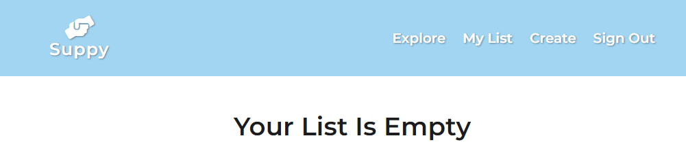
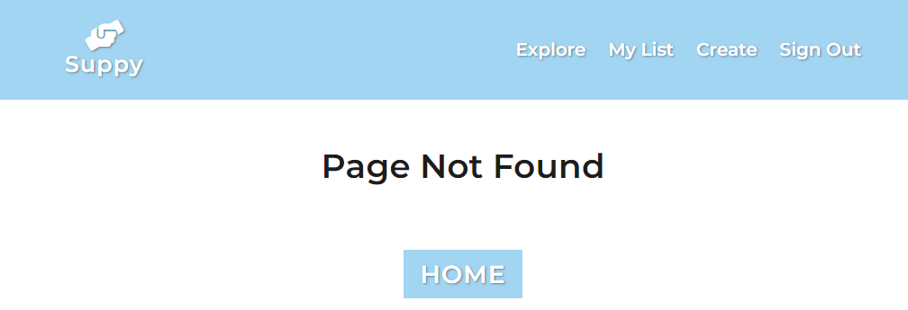
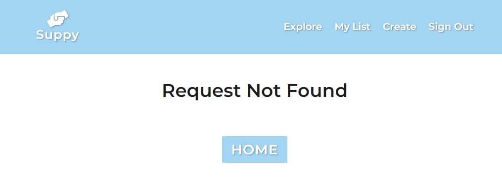

# Suppy

## Goal:

This website was created for people that are infected with COVID-19 virus. If user needs something that he can't complete, he may create request, 
so someone else can help him.

[live](https://wonderful-shaw-021d74.netlify.app)

## Views:

### Sign In/Sign Up 

&nbsp;

### Explore:

### Details:

### MyList:

### Create:

### Errors:

## Functionality:
### Navbar (two link types):

-for signed in users:

a)explore - shows Explore component to user

b)my list -  shows MyList component to user

c)create -  shows Create component with creation form to user

d)sign out -  shows Explore component to user and signs him out

-for signed out users:

a)explore -  shows Explore component to user

b)sign in -  shows SignIn component to user

### Sign In / Sign Up (for signed out users):

-user can toogle between those components by clicking at bold 'sign in' or 'sign out' area

-after succesful signing user will be carries to Explore component

-sign up validation:

a) user can't create multiple accounts with one email adress

b) password between 8-15 characters

c) password must contain at least one digit

d) password must contain at leat one capital letter

e) password shall not contain white spaces

-sign in validation:

a) user not found in database

b) user acc was disabled by admin

c) wrong password

### Explore:

-user can see current requests, that are ordered by creation date

-request card contains: title, country and city name, creation date, 'MORE' button

-user can click 'MORE' button to see details

### Details (only for signed in users): 

-user can see request details such as: title, description, exact location, contact email and phone number

-user can click 'HOME' button and return to Explore component

### MyList (only for signed in users):

-user can see his requests

-user can delete them by clicking at "DONE" button

-when list is empty user will see 'Your List Is Empty' title

### Create (only for signed in users):

-user can create request,

-validation:

a) fields can't be empty,

b) country and city field can contain only letters,

c) email must contain '@' sign

d) phone number must contain 9 digits

### Error types:

-authorization required (when signed out user tries to visit '/create','my-list','/details/:id')

-already signed in (when user tries to visit /sign-in, /sign-up while being signed in)

-request not found (when user tries to visit /details/:id with wrong id)

-page not found (when user tries to visit incorrect path)

